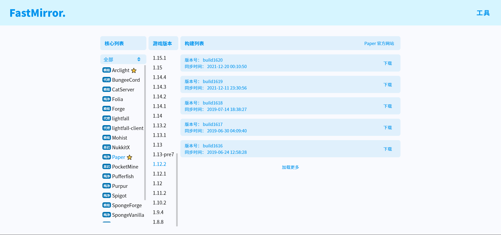

### **安装环境**
::: info
因Minecraft Java版由Java语言开发，所以您必须在计算机中安装Java才能使其运行。
:::
我的世界Java版客户端与服务端的运行需要Java运行时环境(Java Runtime Environment)对程序进行运行。你要在电脑中对其进行下载并安装。

下载地址：http://www.java.com/download/

---
### **Minecraft版本与Java版本对照**
推荐使用1.12.2可以兼容更多插件
| Minecraft版本    | Java版本  | 下载 Java |
| -------- |---------|---------|
| Minecraft 1.7.10 | Java 7  | [下载](https://www.oracle.com/java/technologies/javase/javase7-archive-downloads.html)  |
| Minecraft 1.8.8 | Java 8  | [下载](https://www.oracle.com/java/technologies/javase/javase8-archive-downloads.html)   |
| Minecraft 1.12.2 | Java 8  | [下载](https://www.oracle.com/java/technologies/javase/javase8-archive-downloads.html)   |
| Minecraft 1.16.4 | Java 11 | [下载](https://www.oracle.com/java/technologies/javase/jdk11-archive-downloads.html)   |
| Minecraft 1.18.2 | Java 17 | [下载](https://www.oracle.com/java/technologies/javase/jdk17-archive-downloads.html)

---

### **获取服务端核心**
::: info
服务端核心是启动Minecraft服务端的必要程序。其分为多种版本和类型，支持的功能也各不相同。以下是常见服务端核心的种类与介绍以及获取方式。
:::

服务器核心介绍->[传送门](/open-server/n1.md)

服务端核心下载镜像站->[传送门](https://www.fastmirror.net/#/download/Paper?coreVersion=1.12.2)



---

### **启动服务端**
下载完成你会得到一个.jar后缀的服务端核心文件。
在你的服务端核心的目录下新建一个文本文件，将下面的代码复制进去，然后将文件后缀改为.bat，双击该.bat文件即可启动服务端。

```cmd
@echo off
java -Xmx1024M -jar minecraft_server_1.x.x.jar -nogui
pause
```
其中的 ```-Xmx1024M``` 用于指定最大内存，您可将 ```1024M``` 更换为您需要指定的最大内存，例如 ```-Xmx2048M```，```-Xmx4G```。   

一、首次运行自动关闭
在首次运行服务端核心时会在生成初始文件后关闭。是因为需要同意Mojang发布的使用规则协议。

> 打开服务端根目录 eula.txt 文件
> 将 eula=false 改为 eula=true并保存
> 重启服务端

此时你已经成功启动了无任何插件和配置的原版服务器，可以通过客户端多人游戏页面输入127.0.0.1:25565加入服务端

因为当前未配置内网穿透，所以无法通过公网IP访问服务端，你的朋友不在同一个局域网下无法加入服务器
那么如何获得公网IP呢？待更中

如果你想设置服务端各种参数和配置请点[服务端文件介绍]()


